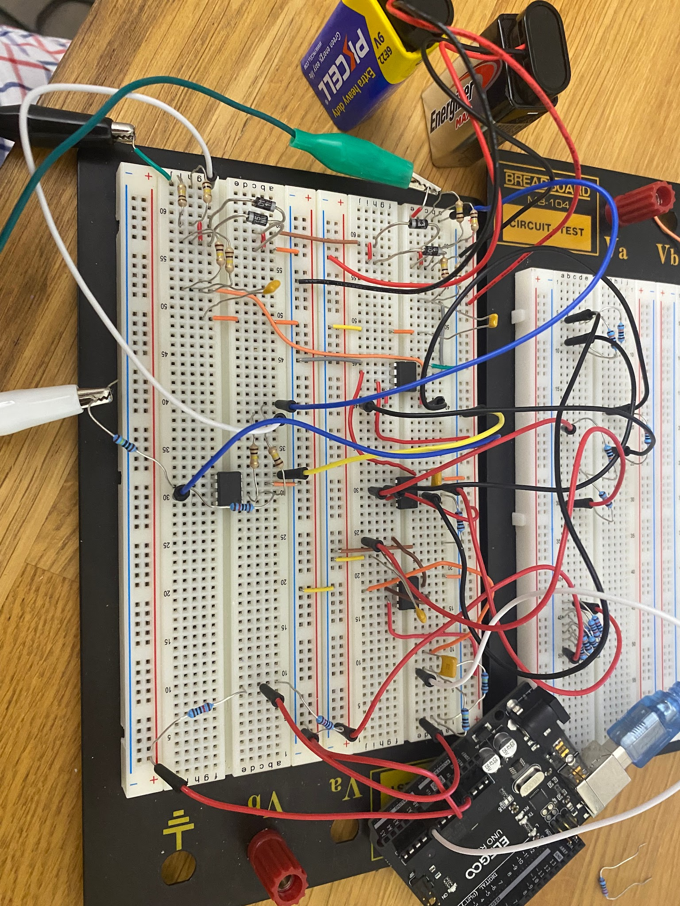
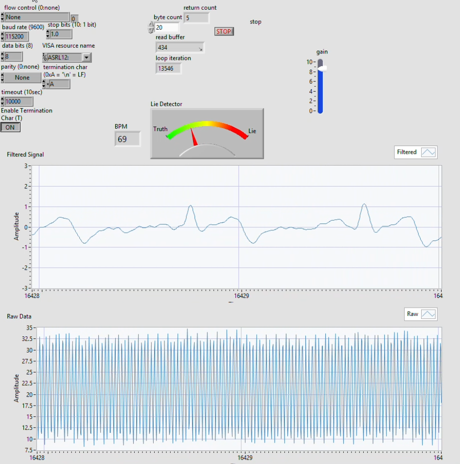
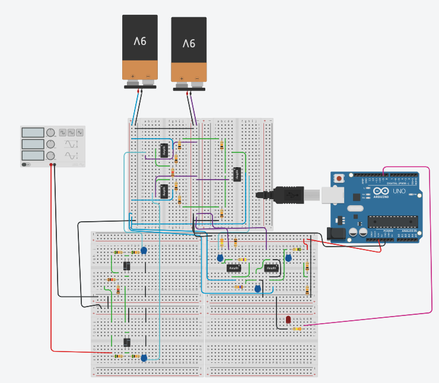
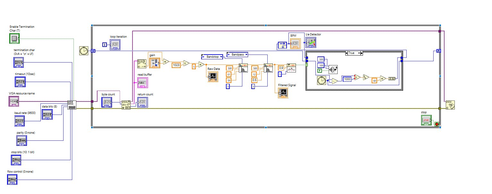
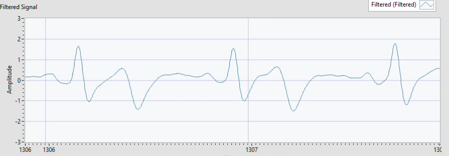
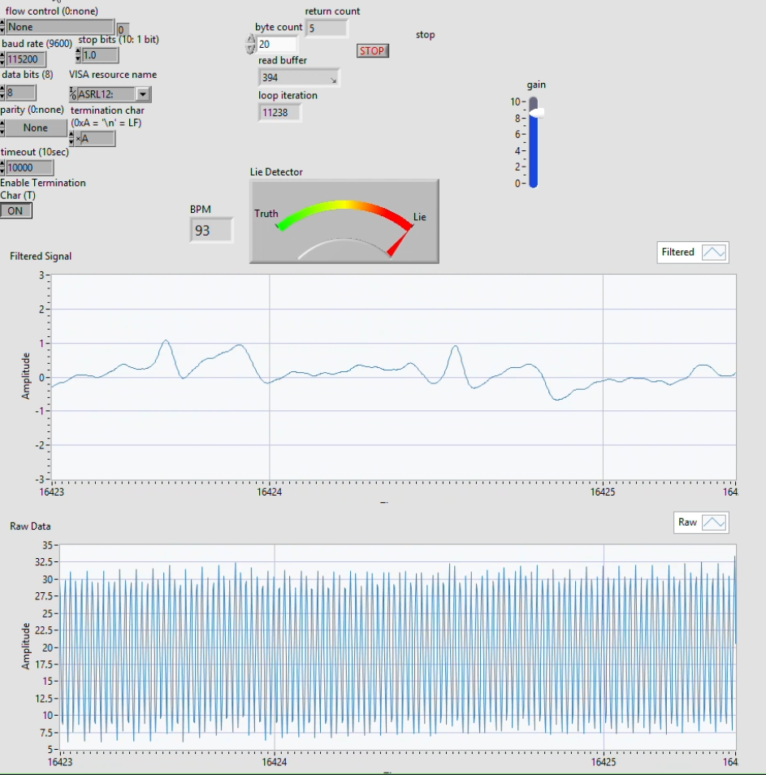

# Arduino–LabVIEW ECG Monitor

An educational ECG acquisition prototype that combines an analog signal-conditioning circuit, an Arduino Uno, and a LabVIEW dashboard for real-time visualization and basic heart-rate estimation.



## What the project does

1. An AD620 instrumentation amplifier raises the small differential input signal.
2. Analog high-pass and low-pass stages reduce baseline drift and high-frequency noise.
3. The Arduino samples the conditioned signal on `A0` at 500 Hz and sends each reading over serial at 115200 baud.
4. The LabVIEW VI reads the serial stream, displays raw and filtered waveforms, detects peaks, estimates BPM, and provides an adjustable display gain.
5. An LED on Arduino pin `D3` responds to readings above the configured threshold, with a 250 ms lockout to reduce double-triggering.

## Repository layout

```text
firmware/ecg_monitor/ecg_monitor.ino  Arduino acquisition and LED logic
labview/ECG_Monitor.vi                LabVIEW monitoring application
docs/images/                          Circuit, interface, and prototype images
```

## Signal-chain design

The supplied design notes use the following target values:

| Stage | Design target | Selected values |
| --- | --- | --- |
| AD620 instrumentation amplifier | Gain ≈ 200 | `R_G = 220 Ω` |
| Active high-pass filter | Gain ≈ 6; cutoff ≈ 0.5 Hz | `R_i = 10 kΩ`, `R_f = 50 kΩ`, `C = 1 µF`, `R ≈ 330 kΩ` |
| Unity-gain low-pass filter | Cutoff ≈ 40 Hz | `R ≈ 40 kΩ`, `C = 0.1 µF` |
| Arduino acquisition | 500 samples/s | 2,000 µs sample interval |
| Serial link | One integer sample per line | 115200 baud, 8-N-1, LF termination |

See the [design calculations](docs/images/design-calculations.jpg) and [circuit diagram](docs/images/circuit-diagram.png) for the original project references.

## Quick start

### 1. Build and verify the analog circuit

Use the circuit diagram and design calculations as references. Confirm the IC pinouts and power rails against the exact parts in your build before applying power. It is best to validate the signal chain with a signal generator or ECG simulator first.

### 2. Upload the Arduino firmware

1. Open `firmware/ecg_monitor/ecg_monitor.ino` in the Arduino IDE.
2. Select **Arduino Uno** and the correct serial port.
3. Upload the sketch.
4. If testing with the Serial Monitor, set it to **115200 baud**.

The default firmware expects the conditioned analog output on `A0` and an LED on digital pin `D3`. The LED threshold is `950` ADC counts and can be adjusted near the top of the sketch.

### 3. Run the LabVIEW dashboard

1. Close the Arduino Serial Monitor so LabVIEW can access the port.
2. Open `labview/ECG_Monitor.vi` in LabVIEW.
3. Choose the Arduino's VISA serial resource.
4. Use `115200` baud, 8 data bits, no parity, one stop bit, and LF termination.
5. Run the VI and verify that the raw-data graph updates.
6. Adjust the dashboard gain and filter settings as needed for the test signal.



The [LabVIEW block diagram](docs/images/labview-block-diagram.png) is included as a reference for the serial, filtering, peak-detection, and BPM-processing path.

## Tuning notes

- `threshold` in the Arduino sketch depends on circuit gain, electrode placement, ADC reference, and signal offset.
- `lockoutPeriod` is set to 250 ms, which prevents repeated LED triggers for the same peak and limits detection to at most 240 events per minute.
- Peak detection and BPM output should be calibrated against a known test signal before relying on the displayed value.
- If the waveform clips near 0 or 1023 ADC counts, reduce analog gain or correct the signal bias before changing the software.

## Safety

This is an educational prototype, **not a medical device**, and it must not be used for diagnosis or patient monitoring. Do not attach a homemade circuit to a person while it is connected to USB, an oscilloscope, a mains-powered supply, or other grounded equipment unless appropriate medical-grade isolation and qualified supervision are in place. Prefer an ECG simulator for development and testing.

## Project gallery

| Circuit diagram | LabVIEW processing |
| --- | --- |
|  |  |

| Filtered waveform | Alternate dashboard capture |
| --- | --- |
|  |  |

